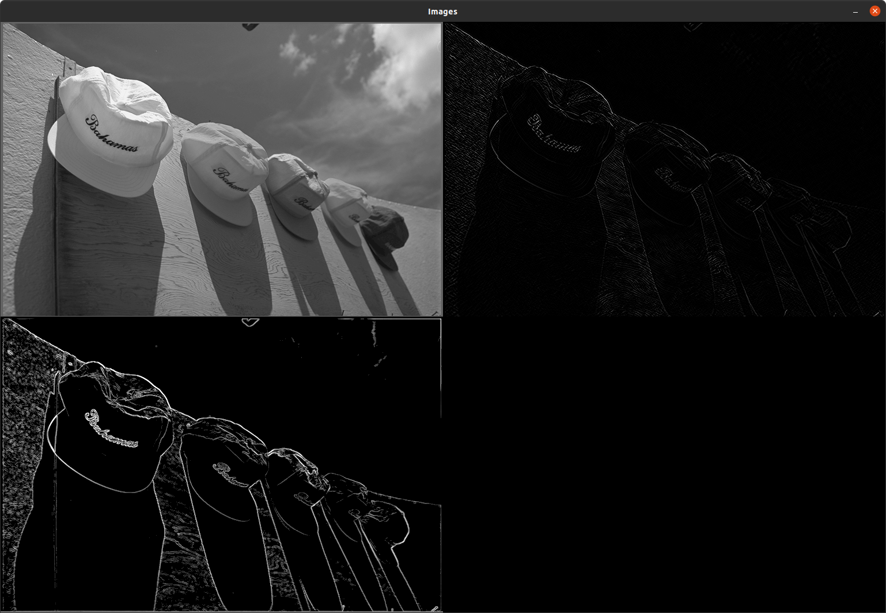

# Image Filters Project

This project demonstrates the use of OpenCV and the Ninja build system to create a simple image processing application. The application applies various filters to an input image and saves the processed output. It includes custom implementations of filters and performs benchmarking against OpenCV's built-in filters to evaluate performance and accuracy.

## Prerequisites

- OpenCV library
- CMake (with Ninja generator)
- A C++ compiler

## Build Instructions

1. Clone the repository:
   ```bash
   git clone git@github.com:athish-t/image-filters.git
   cd image-filters
   ```

2. Configure the project:
   ```bash
   cmake -S . -B build
   ```

3. Build the project:
   ```bash
   cmake --build build
   ```

## Run the Application

After building, run the application with an input image and specify an output path:
```bash
./build/main <input_image_path> <output_image_path>
```

For example:
```bash
./build/main img/kodim03.png /tmp/output.png
```

Apart from saving the output, the application also displays a visual comparision of the output from openCV's implementation and our own implementation:


```
(top-left: Original Image)       (top-right: OpenCV Output)

(bottom-left: Custom Output)
```

The console log shows timing benchmarks:
```
Execution time of applyBenchmark: 2176 microseconds
Execution time of padBoundaries: 173 microseconds
Execution time of getGradient: 5338 microseconds
Execution time of getGradient: 2674 microseconds
Execution time of combineGradients: 946 microseconds
Execution time of removeBoundaries: 177 microseconds
Execution time of applyXYKernels: 9502 microseconds
Execution time of apply: 9507 microseconds
Image saved successfully to: /tmp/output.png
```

## Project Structure

- `src/`: Contains the source code for the application and filters.
- `include/`: Contains header files for the project.
- `build/`: Contains build artifacts.
- `test/`: Contains unit tests for the filters.
- `img/`: Contains sample images for testing.
- `docs/`: Contains static files used for documentation

## Testing

To build and run all the tests:
```bash
cmake -S . -B build && cmake --build build && ./build/test_blur && ./build/test_image_filter && ./build/test_scharr && ./build/test_sobel
```

## TODOS

Add more tests to verify edge cases, thresholding, and realistic data

## Notes of optimizations

1. Using a flat array data structure to hold to 2D image data provides lot of efficiency by improving cache locality.
2. Simple parallelization using execution policies in std::for_each provides significant gains. Parallelization can be improved by using openMP parallel, however for small image sizes such as the test image, parallelization seems to add more overhead. We could introduce dynamic selection to optionally parallize for large images when using openMP parallel.
3. openMP's SIMD could be used to speed up computation of derivatives, however this did not have any noticeable effect in the current implementation. I believe it could be used in combination with openMP parallel to provide signifiant speed up
4. Calculating gradients in X and Y separately and combining them adds overhead due to multiple passes, and this has a noticeable performance hit. However this implementation was chosen compromising marginal speed gain, to provide the extensible filter pipeline design.
5. Unrolling the kernel derivative calculation instead of looping over the kernel's cells provided significant speed up.
6. The kernel could also be stored as a flat array to make computation even faster.
7. More compiler optimizations during the derivative calcuations, such as vectorization and memory alignment could speed up even more, but these were not explored due to time constraint

## License

This project is licensed under the MIT License.
